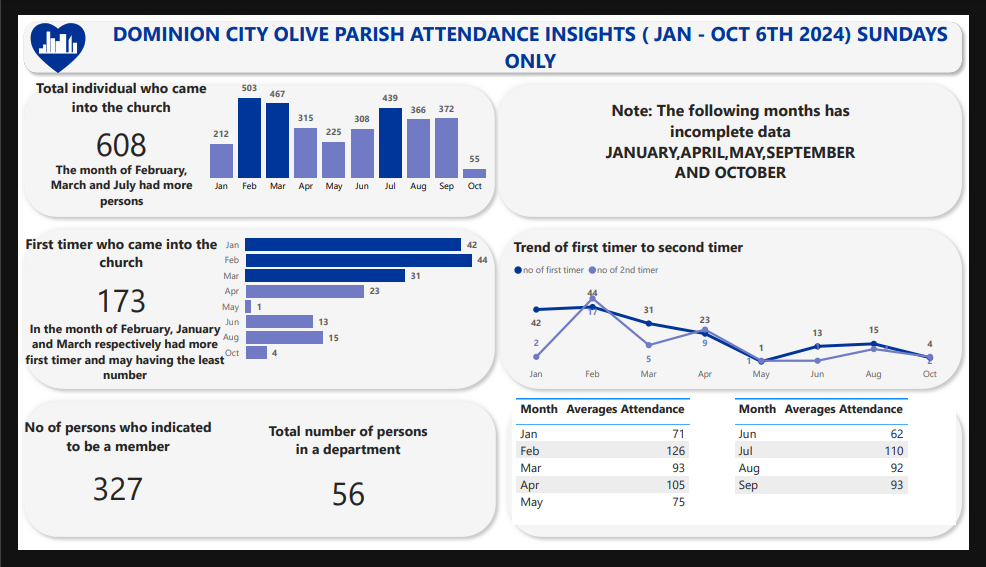

## Dominion City (Olive Parish) Attendance from January to October insight Data Analysis

## Table of Contents
- [Project Overview](#project-overview)

- [Objectives](#objectives)
 
- [Process](#process)

- [Tools](#tools)

- [Key Insights](#key-insights)

- [Challenges and Solutions](#challenges-and-solution)

### Project Overview
This project analyzes Dominion city Olive Parish Sunday service attendance from January to October data to uncover trends and patterns, providing actionable insights for strategic planning. It focuses on improving attendance tracking and creating meaningful visualizations for stakeholders.

### Objectives
-	Track Total Attendance: Ensure accurate tracking of all individuals attending church services, avoiding duplicate entries across dates.
-	Analyze Monthly Attendance Trends: Identify attendance patterns for Sunday services on a monthly basis.
-	Track First-Time Visitors: Calculate the total number of first-time attendees and their trends over the months.
-	Monitor First-to-Second Timer Conversion: Analyze the rate at which first-time visitors return for a second visit.
-	Evaluate Average Attendance: Determine the average monthly attendance to gauge overall engagement.
-	Identify Active Members: Calculate the total number of active church members.
-	Assess Department Engagement: Track the number of individuals actively serving in various departments.

### Process
1.	Data Collection: The church collected service data throughout the year. Data entry was outsourced, but significant cleaning was required to make it analysis ready
2.	Data Cleaning:
-  Removed duplicates.
- Standardized names and dates used fuzzy logic (specifically fuzzy matching techniques) to handle inconsistent or similar entries.
-	Addressed missing values.
3.	Analysis and Visualization:
-	Trends and patterns in attendance data were analyzed.
-	Created dashboards in Power BI.

### Tools
- Microsoft Excel: Data cleaning and validation.
- Power BI: Dashboards and visualizations.

### Key Insights
-	Seasonal attendance peaks during special events.
-	Services with low engagement identified for improvement.
-	Streamlined data tracking improves decision-making.

### Challenges and Solutions
-	The manual data entry process led to initial inconsistencies, which required substantial cleaning efforts.
-	Managing duplicate entries was a priority to ensure data accuracy using fuzzy logic

1. Evaluation Metric: The model's performance was evaluated using accuracy.

2. Results: The model achieved an accuracy score of 0.75, meaning it correctly predicted 75% of the test data.

